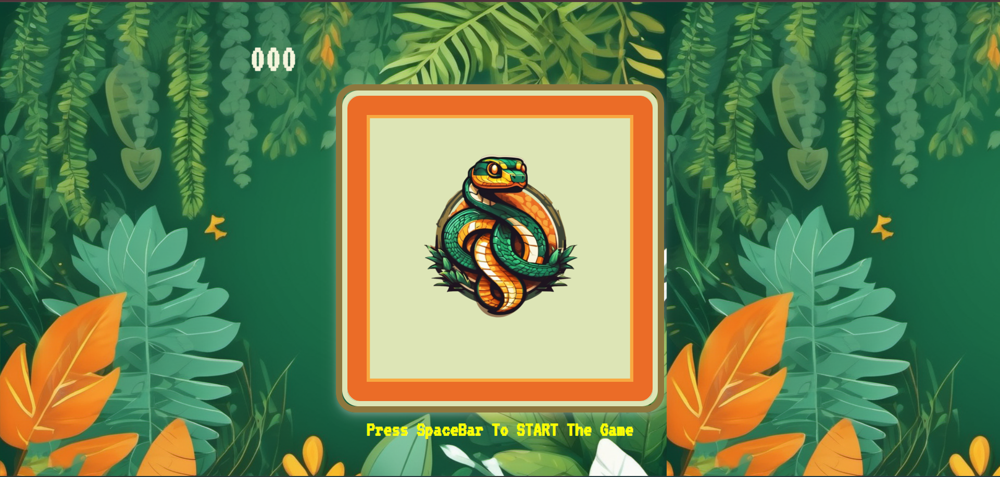
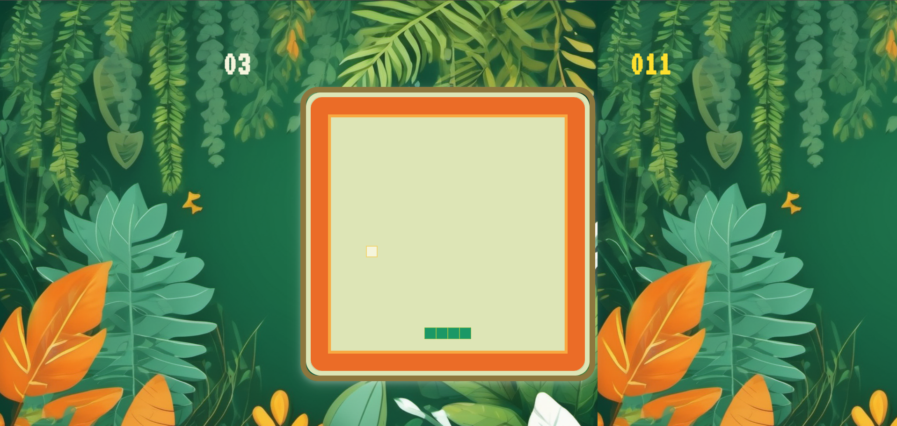

# Snake Game🐍
Snake is a game where you control a growing snake, eating food🍅 to increase length while avoiding walls and yourself.
## Features
* Key press controls.
* Displaying Current Score and High Score.
* Amazing UI.
## Description
1. Press `Space` to start the game

2. Use `Up` `Down` `Right` `Left` Arrow Keys to move snake.At top right corner is `High Score` and at top left corner is `Current Score`.

## Reference
* [FreeCodeCamp Tutorial](https://www.youtube.com/watch?v=uyhzCBEGaBY)
